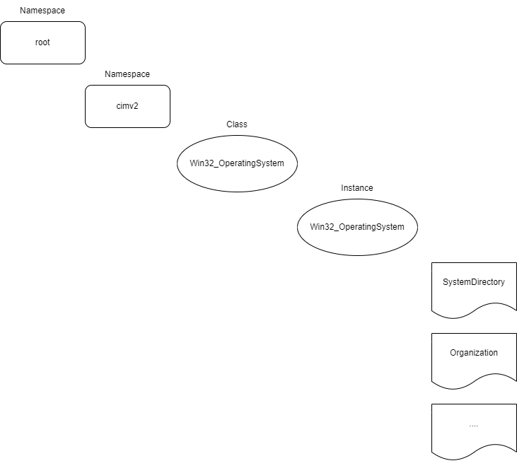

# WMI

In my career, I've always heard of people using WMI, so I wanted to see what all the hoopla was about.  Up until now, all I had ever seen was the occansional wmic command.  What I didn't realize was how rich the information is and that you can run wmi commands to "do" things like start processes.

## Motivation for WMI
Wmi is an implementation of a standard called CIM (Common Information Model) developed by DMTF.org (Distributed Management Task Force).  The idea behind CIM is that a comittee designs the way to express computer management information, and then everybody can implement the solution in terms of their own platform.  Microsft's implementation is called WMI and there are solutions for Linux based solutions, but I don't discuss them here.

## General Approach to Introduction
Words here

## Basic Wmi Commands
The best way I know to introduce WMI is to just show some commands and their output.  At the lowest level, you interact with wmi via COM.  There exists powershell commands that wrap this api and will allow us to play with wmi quicker.

### WMIC.exe

`PS C:\Program Files (x86)\Windows Kits\10\Debuggers\x64> WMIC.exe CPU
AddressWidth  Architecture  AssetTag                Availability  Caption                                Characteristics  ConfigManagerErrorCode  ConfigManagerUserConfig  CpuStatus  CreationClassName  CurrentClockSpeed  CurrentVoltage  DataWidth  Description                            DeviceID  ErrorCleared  ErrorDescription  ExtClock  Family  InstallDate  L2CacheSize  L2CacheSpeed  L3CacheSize  L3CacheSpeed  LastErrorCode  Level  LoadPercentage  Manufacturer  MaxClockSpeed  Name                                            NumberOfCores  NumberOfEnabledCore  NumberOfLogicalProcessors  OtherFamilyDescription  PartNumber              PNPDeviceID  PowerManagementCapabilities  PowerManagementSupported  ProcessorId       ProcessorType  Revision  Role  SecondLevelAddressTranslationExtensions  SerialNumber            SocketDesignation  Status  StatusInfo  Stepping  SystemCreationClassName  SystemName       ThreadCount  UniqueId  UpgradeMethod  Version  VirtualizationFirmwareEnabled  VMMonitorModeExtensions  VoltageCaps
64            9             To Be Filled By O.E.M.  3             Intel64 Family 6 Model 140 Stepping 1  252                                                               1          Win32_Processor    2995               8
64         Intel64 Family 6 Model 140 Stepping 1  CPU0                                      100       198                  5120                       12288        0                            6      3               GenuineIntel  2995           11th Gen Intel(R) Core(TM) i7-1185G7 @ 3.00GHz  4              4                    8                                                  To Be Filled By O.E.M.                                            FALSE                     BFEBFBFF000806C1  3                        CPU   TRUE                                     To Be Filled By O.E.M.  U3E1               OK      3                     Win32_ComputerSystem     DESKTOP-JPETSOM  8                      1                       TRUE                           TRUE`

Above I used the "wmic" command which wraps wmi to make it a bit nicer to query wmi (we will dive into the details in a sec!).  We simply asked for some cpu information and it provided a ton of info. You can run
```
wmic.exe /?
```
to see a large list of different stuff you can query.

### Get-CimInstance
```
PS C:\Users\cplus\source\repos\wmi_blog> Get-CimInstance -ClassName Win32_OperatingSystem

SystemDirectory     Organization BuildNumber RegisteredUser            SerialNumber            Version
---------------     ------------ ----------- --------------            ------------            -------
C:\WINDOWS\system32              22621       cpluspluspython@gmail.com 00325-81907-56073-AAOEM 10.0.22621
```

`Note: I am using the "CIM" set of cmdlets as wmi has officially been deprecated, but seems still widely used.`

We haven't talked about wmi structure yet, but you can tell that we are querying for a "cim instance" of the class "Win32_OperatingSystem".  Below, I'll disect some of the vocabulary needed to understand WMI (or CIM in this case).

## CIM structure
In CIM, there is a hierarchy of data.  The heirarchy goes:

| Name      | Description |
| ----------- | ----------- |
| Namespace      | Basically the folder structure of everything in CIM.  On Windows, most things will be in root/cimv2 (Win32_OperatingSystem exists here too), but there are items in other locations too.       |
| Class   | Very similar to the class construct in C++ or other programming languages.  Essentially this is CIM's way to represent how a particular thing is represented.  For example there is <TODO> which you can have any number of on a system.        |
| Instance | An instance is... well an instance of a particular class!  Imagine a class for hard drives and your system had 3 hard drives.  You would represent this as 3 instances of the hard drive class. |
| Properties | A property is a data element of a class.  Think of properties as "class members" in C++.  An example could be total size of a hard drive. |
| Methods | Methods can be added to classes that can be called to do something.  There is `Win32_Process::Create` which can create a process.|

A quick graphical example of these concepts are below for the `Win32_OperatingSystem` query we ran above.




Knowing the structure of CIM objects, we now know that the command
```
PS C:\Users\cplus\source\repos\wmi_blog> Get-CimInstance -ClassName Win32_OperatingSystem
```
was querying for all instances of the `Win32_OperatingSystem` class.  A more interesting query here would be to get items from a class that would have multiple instances

```
PS C:\Users\cplus> Get-CimInstance -Class "Win32_Process"

ProcessId Name                                                          HandleCount WorkingSetSize VirtualSize
--------- ----                                                          ----------- -------------- -----------
0         System Idle Process                                           0           8192           8192
4         System                                                        5753        163840         4173824
144       Registry                                                      0           36667392       203415552
```


### Wmi Methods
In addition to querying data from cim instance, it is possible for a cim classe to have methods. There are two types of methods:
| static method | This is a method that is associated with a class rather than instance.  Just like static methods in C++.
| normal method | A method that is tied to an instance.

In case that didn't make sense, consider the cim class "Win32_Process".  One method is "Create" which creates a process.  This would be a static method cause there isn't an active process to associate this with.  However, the "Terminate" method will have to be executed against an instance of "Win32_Process".  Let's play around with these methods real quick:
```
PS C:\Users\cplus\source\repos\wmi_blog> Invoke-CimMethod -ClassName Win32_Process -MethodName "Create" -Arguments @{CommandLine = 'notepad.exe'; CurrentDirectory = "C:\windows\system32"}

ProcessId ReturnValue PSComputerName
--------- ----------- --------------
    14580           0
```

Quick explainer on the command, we are using the `Invoke-CimMethod` to call into wmi, we specify the `Win32_Process` class, specify we want to call the `Create` method and provide the arguments needed to execute that method.  You should see that an instance of notepad opens.  For the sake of playing around, what would the wmi powershell look like to close it?  First we would need to get this instance which we can do with

```
PS C:\Users\cplus\source\repos\wmi_blog> Get-CimInstance -Query 'Select * from Win32_Process where processid = 14580'

ProcessId Name        HandleCount WorkingSetSize VirtualSize
--------- ----        ----------- -------------- -----------
14580     notepad.exe 189         13283328       2203459665920
```

Then we just need to execute the "terminate" method on this instance.
```
PS C:\Users\cplus\source\repos\wmi_blog> $x = Get-CimInstance -Query 'Select * from Win32_Process where processid = 14580'
PS C:\Users\cplus\source\repos\wmi_blog> Invoke-CimMethod -InputObject $x -MethodName Terminate

ReturnValue PSComputerName
----------- --------------
          0
```

# More Explorering.
Up until this point, I've been spoon feeding you the commands/classes/properties/methods to play with.  To explore what else is out there, Microsoft has a pretty helpful GUI tool "wbemtest" which you can use to play around with the CIM namespace.  We will play with this tool when we develop a provider for WMI.


## Summary
In this first part, we got a quick introduction into what WMI is, it hierarchy and a brief introduction into how to interface with it via some powershell commands.