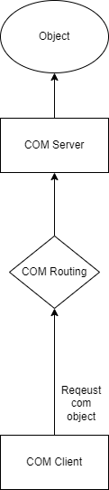
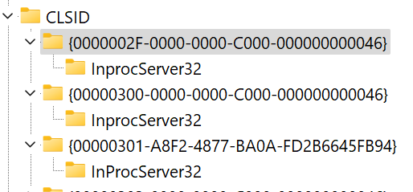
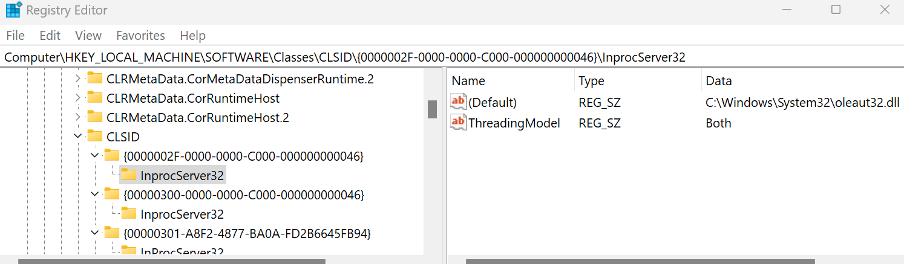

## Writting a COM server

If you're like me, you've never written a COM server, but you've used COM objects before.  This post goes over the basics of what's needed and some of the roadblocks I hit when trying to adapt the current literature for the specialness of wmi providers.

# Motivation for COM
What is the point of COM?  COM is a technology from Microsoft developed in the 90's that is heavily imbedded into how alot of user mode stuff works.  The idea was that someone could write a COM object in C++, but it could be accessed by any other language with COM bindings.  I've written things in C++, C#, and python that used COM objects and I'm sure most other popular languages have bindings.

## High Level


The image above shows the basic flow for getting objects from COM.  A client app requests an object via `CoCreateInstance`.  The "COM Routing" part there is dependent on how the com server is implemented.  A Com server can be either:
* In proc server - The COM routing here will find the dll which hosts the com server and loads it in your process address space.  It then invokes functions in the DLL to eventually return the requested COM object.
* Out of proc server - This COM object will _not_ be loaded into the process space for the requesting process.  That means that the COM server can exist in another process or even on a remote machine.
## Building a COM Server
For our purpose, we will just be creating a simple in-proc COM server.  You will need to create a new project in visual studio and produce a dll.  Once you have that setup, there are 4 exported functions you must define:

| Name | Description |
------|------------
| DllGetClassObject | Called when a COM client requests an object from this server. |
| DllCanUnloadNow | Called when the COM engine wants to unload a server.  For in-proc servers, this can be called when a server has 0 references to objects it provides, so the COM engine might try to unload the DLL. |
| DllRegisterServer | This is usually called by `regsrv32.exe` to intially register your dll with COM.  This function will make the necesarry edits to the registry so that COM can find your dll for a given ID. |
| DllUnregisterServer | Oppisite of `DllRegisterServer`.  Will undo the changes to the registry to completely remove your server from the system. |

### Implementing Exported Functions
Included with this blog post is an example `Com Server Example` which we will reference here.  I don't walk through the entire code, but I do discuss pieces that I found interesting while doing this.

#### Def File
One annoying thing I discovered with implementing these export functions is that you must provide a def file like this.
```
LIBRARY

EXPORTS
	DllGetClassObject		PRIVATE
	DllCanUnloadNow			PRIVATE
	DllRegisterServer		PRIVATE
	DllUnregisterServer		PRIVATE
```
The content above was generated when you try to create an "ATL project" in Visual studio.  I don't really know how to make a def file beyond this.  Usually when I want to export functions I use something like:
```
__declspec(dllexport) void __cdecl Function1(void);
```
but you cannot do this because COM expects that the exports be named exactly as they are in the table.  In the `declspec` example above, the actual function that gets exported in this case is `__imp_Function1` and to my knowledge, you cannot avoid this name addition.  Thus we _have_ to use the def file.

#### Registry Layout
All COM servers are listed in the registry at `HKLM\Software\classes\CLSID\`. Each entry in this registry key is the GUID for a particular object.  In this case it represents the factory object that will create the WMI provider.  I know this sounds convoluated, but imagine if you had a single dll that exposed several different objects.  You would register one CLSID and then you would query that factory object for the interface you want.



Drilling down into the key, we see `InprocServer32`.  When COM is fetching your object, if it sees this key, it knows it's an in proc com server.  Drilling further, we have the (Default) key that is set to the location of the dll and "ThreadingModel".  Just use "Both" for ThreadingModel.


What I have to say next is extremely important and hopefully I can save you the trouble of having to wip out procmon to figure out why COM can't find your server despite you registering it here.  There are actually _2_ places you can register your COM object.
* `HKLM\Software\classes\CLSID` - 64 bit objects
* `HKLM\Software\classes\WOW6432Node\CLSID` - 32 bit objects

COM will select which registry path to pick based on the bitness of your client, i.e. if you are 32 bit application, then it will look in `HKLM\Software\classes\WOW6432Node\CLSID` and NOT `HKLM\Software\classes\CLSID\`.  Hopefully this saves someone an hour or two :)

#### DllGetClassObject
I don't think this is speific to WMI, but I found it interesting that you don't return the requested object in this function, but instead you must return a factory object that can create your provider objects.  Seems overkill for us, but if we wanted to expose many interfaces it's nice to be able to do it via a single CLSID.

## Conclusion
There is a lot that could be said about COM.  There are entire books after all, but I believe I covered the gist of it and the gotchas for me.  You can see the commented code on the 4 COM functions that you need.